# Appointment Service

An appointment management system designed to streamline scheduling, user authentication, and data handling.  

---

## Architecture Overview

Built using a **.NET 8 backend (Web API)** and an **Angular frontend**, following the **Clean Architecture** pattern.

### Layers

#### 1. **Core Layer (Domain)**
- Contains **Entities**, **Interfaces**, and **Business Logic**.
- Independent of any framework or external dependency.
- Example: `Doctor`, `Patient`, `Appointment` entities.

#### 2. **Infrastructure Layer**
- Handles data persistence and external integrations.
- Uses **Entity Framework Core** with **SQL Server**.
- Implements repositories and data seeding.

#### 3. **API Layer (Presentation)**
- Exposes endpoints through **ASP.NET Core Web API**.
- Includes controllers for authentication, appointments, doctors, and patients.
- Implements **JWT Authentication** and **Authorization**.

#### 4. **Frontend Layer (Angular)**
- Provides an intuitive and responsive user interface.
- Handles user authentication, forms, and API integration.
- Uses Angular services, interceptors, and guards.

---

## Technologies Used

### **Backend**
- .NET Web API
- Entity Framework Core
- SQL Server
- JWT Authentication
- ASP.NET Identity

### **Frontend**
- Angular
- TypeScript
- RxJS
- Angular Material / Bootstrap
- Interceptors for Auth Tokens

### **DevOps**
- GitHub Actions (CI/CD)
- Docker
- Swagger for API Documentation

---

## Getting Started

### Prerequisites
- [.NET 8 SDK](https://dotnet.microsoft.com/)
- [Node.js 20+](https://nodejs.org/)
- [SQL Server](https://www.microsoft.com/en-us/sql-server)
- [Angular CLI](https://angular.io/cli)

---

### Database Setup
Run the docker-compose.yml file
```bash
docker-compose up -d
```

Edit the following line at /Appointments.Api/appsettings.json based the parameters on docker-compose.yml (if changed)
```bash
"ConnectionStrings": {
"Default": "Host=localhost;Port=5432;Database=appointments_dev;Username=postgres;Password=postgres"
}
```

---

### Backend Setup

```bash
cd backend/src/Appointments.Api
dotnet restore
dotnet ef database update
dotnet run
```

The API available at:
```bash
http://localhost:5004
```

If the API is running on another port then change this line
```bash
nano frontend/angular-app/src/environment/environment.ts
export const environment = {
  production: false,
  apiUrl: 'http://localhost:<PORT>/api'
};
```

You can explore all endpoints via Swagger UI at:
```bash
https://localhost:5004/swagger
```

### Frontend Setup
```bash
cd frontend
npm install
ng serve
```

The frontend available at:
```bash
http://localhost:4200
```
If the frontend is running on another port then change this line 
```bash
nano backend/src/Appointments.Api/appsettings.json
{
   "FrontendUrl": "http://localhost:<PORT>",
}
```

---

## Authentication

Authentication is implemented using JWT (JSON Web Tokens).
- After logging in, a token is returned by the backend.
- The AuthInterceptor in Angular automatically attaches the token to every HTTP request.
- [Authorize] is used in the backend to protect private endpoints.
- Example request header:
```bash
Authorization: Bearer <your-jwt-token>
```

---

## Testing
Wich covers:
- Controllers (unit tests)
- Authentication flow
- Repository logic
```bash
cd backend/src/Appointments.Tests
dotnet test
```

---

## ERD Diagram
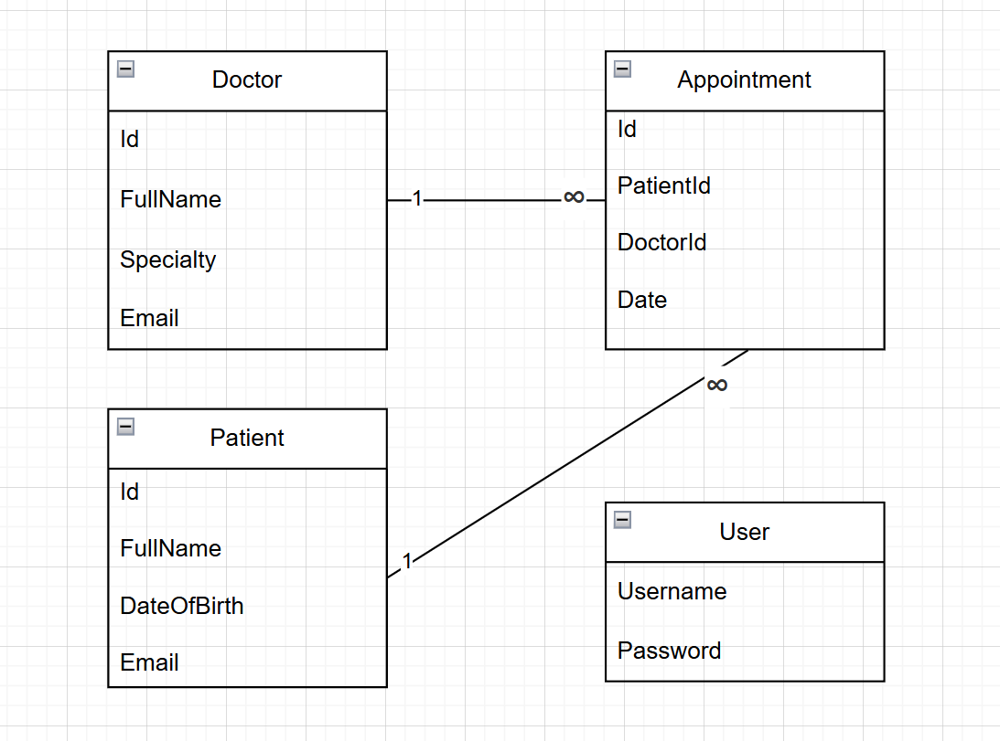

---

## CI/CD with GitHub Actions
This project includes an automated CI pipeline that runs on every push or pull request.


---

## Screenshots

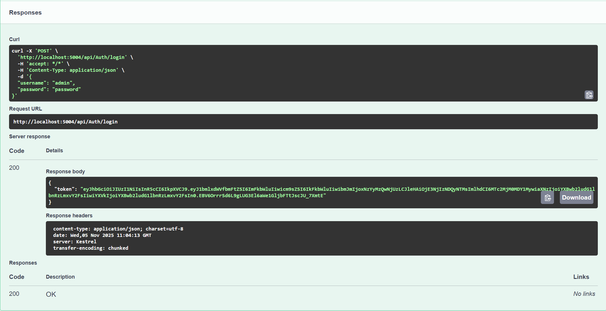

*Getting the Token in Swagger UI*

<br><br>

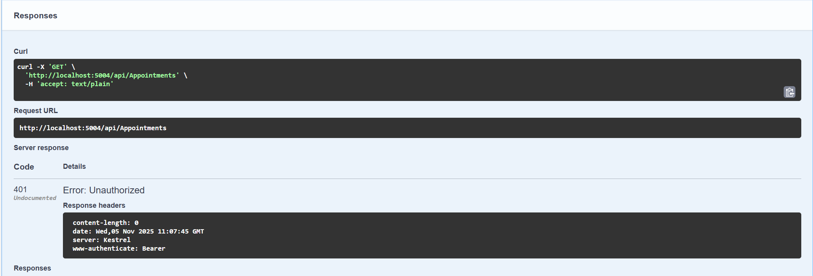

*Trying to get the Appointments without Authorization*

<br><br>


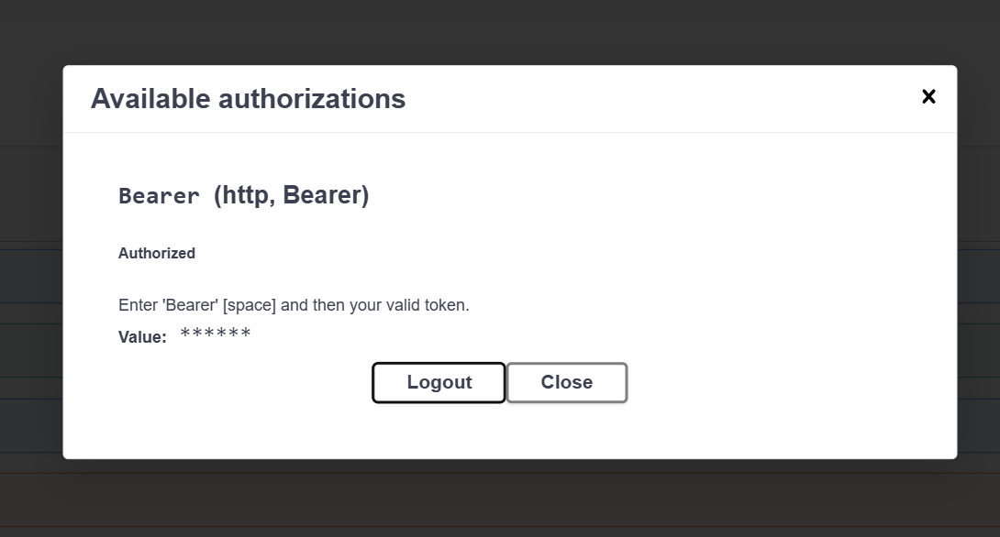

*Authorization using the Generated Token in Swaager UI*

<br><br>

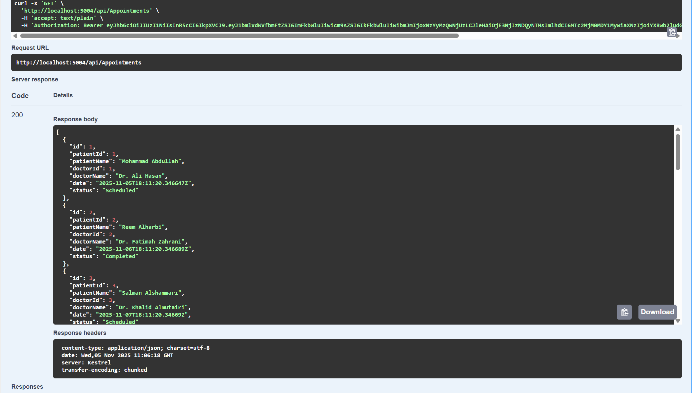

*Appointments in Swagger UI after Authorization*

<br><br>

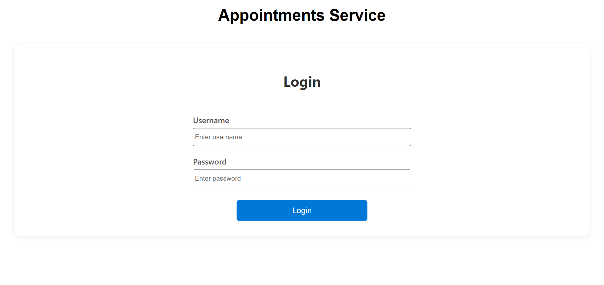

*Login Page*

<br><br>

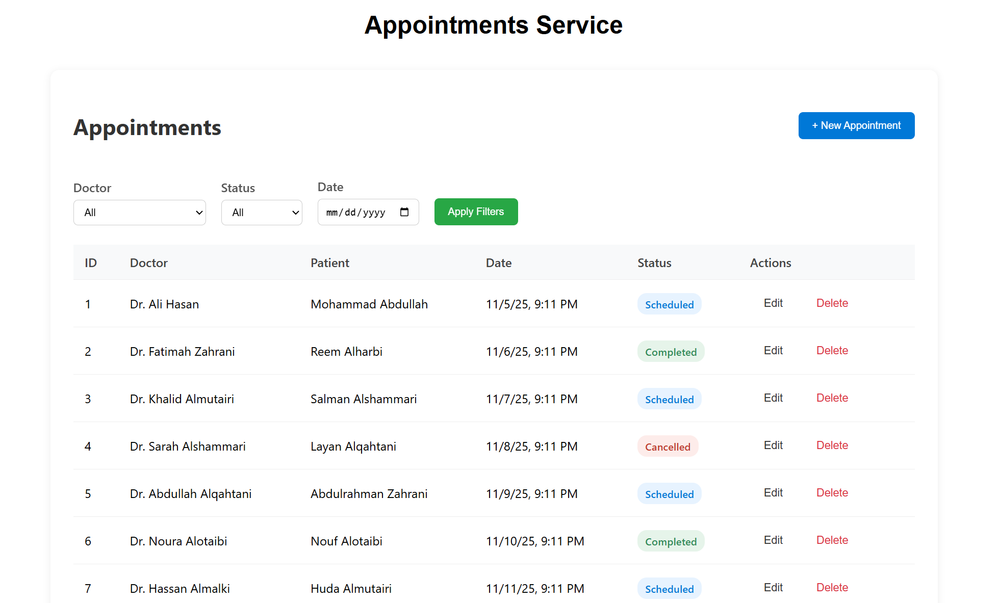

*Appointments List*

<br><br>

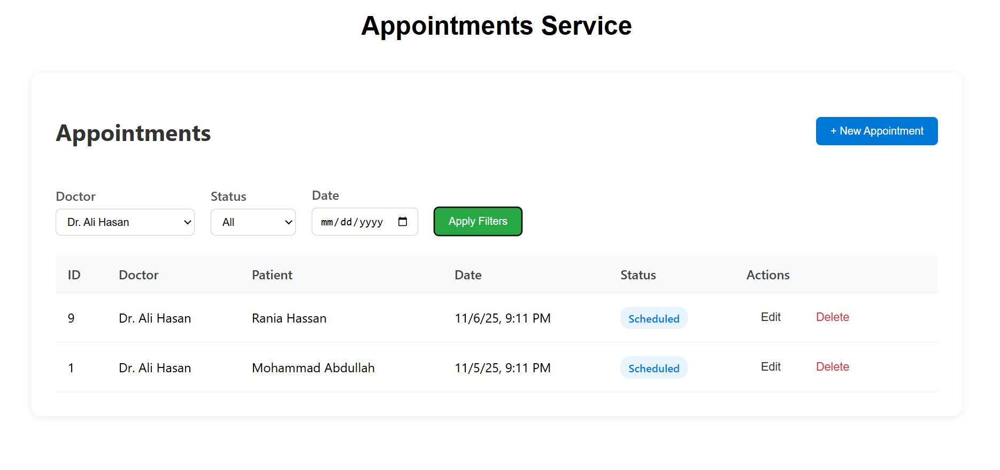

*Filter Appointments By Doctor Name*

<br><br>

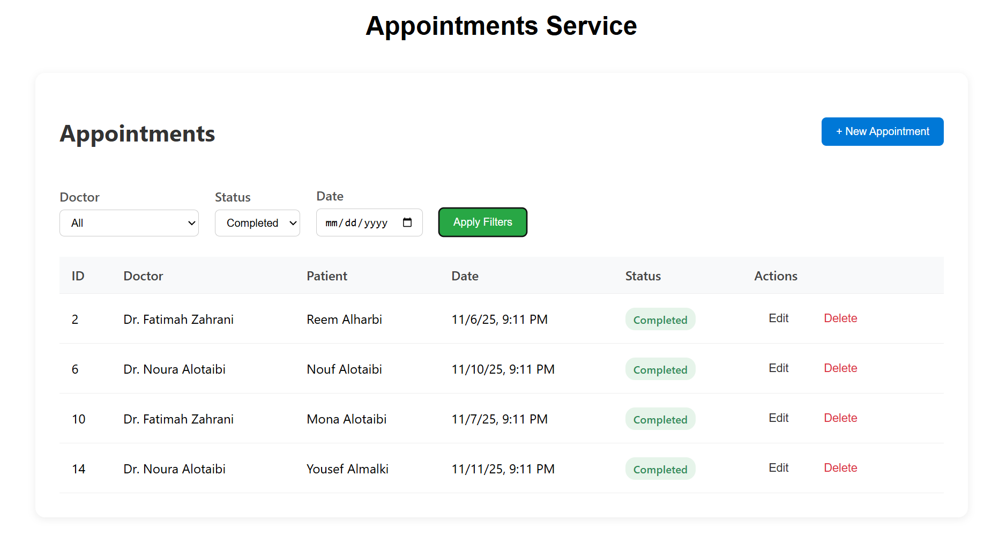

*Filter Appointments By Status*

<br><br>

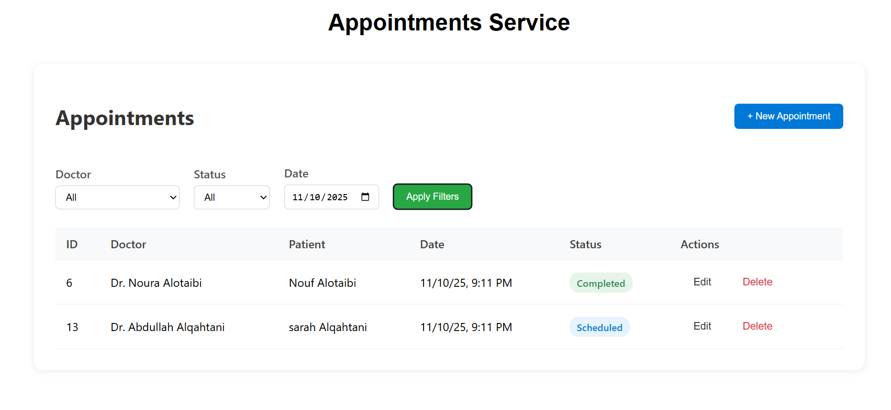

*Filter Appointments By Date*

<br><br>

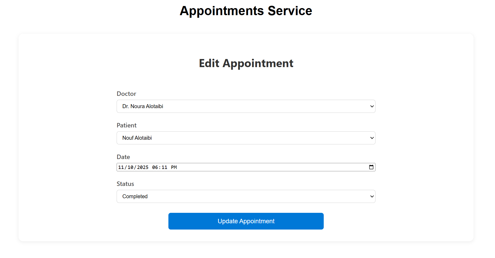

*Appointment Form*

<br><br>

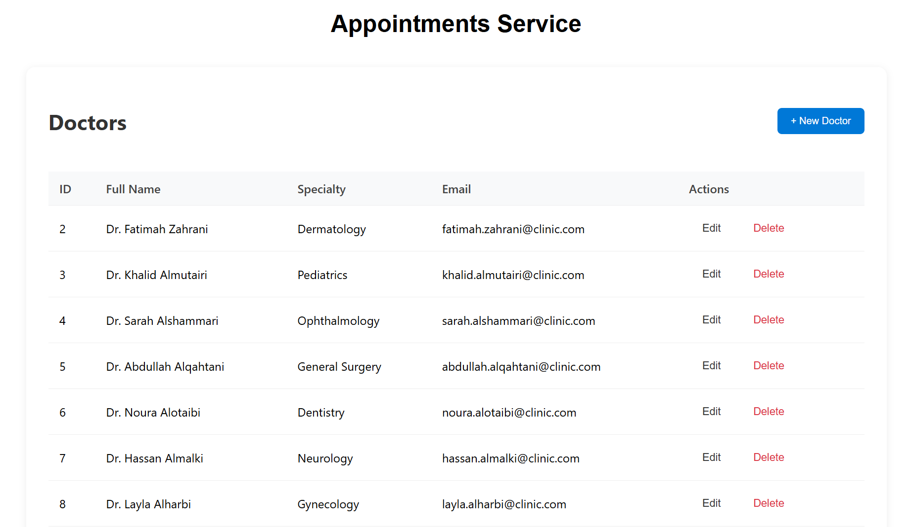

*Doctors List*

<br><br>

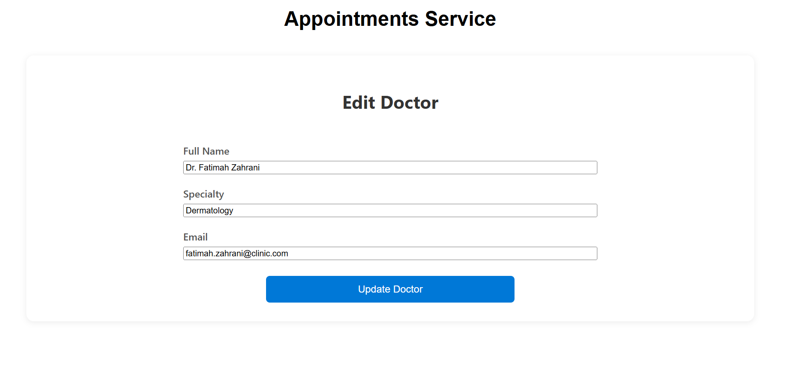

*Doctor Form*

<br><br>

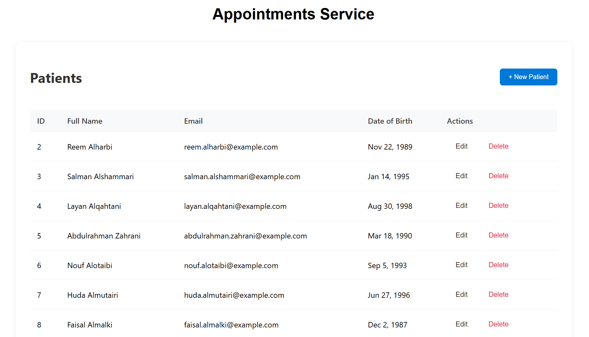

*Patients List*

<br><br>

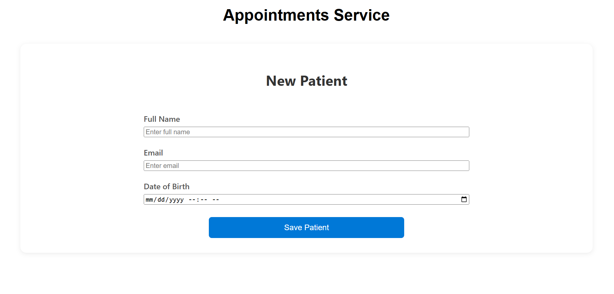

*Patient Form*

<br><br>

